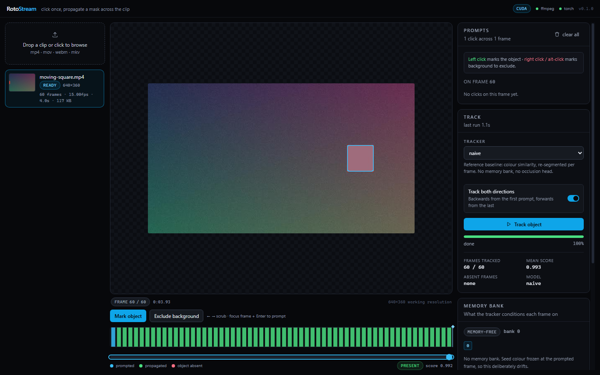
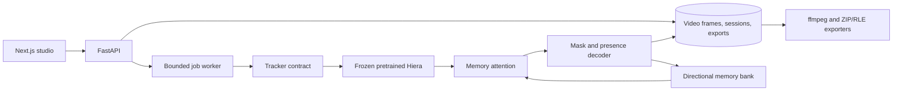

# RotoStream

[](https://github.com/Asterisk-Hunter/rotostream/actions/workflows/ci.yml)

**Click an object in a video, track its mask across frames, and export an editable cutout.**

RotoStream combines a Next.js rotoscoping studio, a FastAPI video pipeline, and an
independent reproduction of SAM 2's memory mechanism. **The pretrained Hiera image
encoder and released SAM 2.1 weights are reused.** The prompt encoder, memory
encoder, directional memory bank, memory attention, mask decoder and presence
head are implemented in this repository. This is a reproduction of
[SAM 2](https://arxiv.org/abs/2408.00714), not a claim of a new model architecture.



## Measured quality

DAVIS 2017 validation: **30 clips, 61 objects, 3,862 scored object-frames**, with
first-frame ground-truth mask prompts and forward causal propagation. Objects are
tracked independently; predictions are not merged into a joint multi-object label
map. This is an independent-object evaluation, not an official leaderboard entry.

<!-- benchmark:start -->
| Tracker | J | F | J&F |
| --- | --- | --- | --- |
| Color baseline | 11.20 | 16.48 | 13.84 |
| SAM 2.1 Hiera-T memory reproduction | 85.89 | 92.91 | 89.40 |
<!-- benchmark:end -->

The neural run uses the released `facebook/sam2.1-hiera-tiny` checkpoint without
DAVIS fine-tuning. Propagation throughput was **2.88 FPS** on an RTX 4050
Laptop GPU at a 1024px encoder resolution; loading, prompts and scoring are
excluded. This implementation does not claim real-time neural inference.

[Results and raw evidence](docs/RESULTS.md) document the exact protocol, weight
revision, timings, weak tracks, decoder/presence parity and training gradient
checks. Synthetic clips are regression tests and are kept out of capability claims.

## The studio

Open **Help** in the editor for the in-app `/docs` field guide. It walks through
marking, tracking, reviewing problem frames and choosing an export in plain terms.

- Upload common video formats with real progress and bounded frame extraction.
- Mark foreground/background with clicks, touch or keyboard input; add corrections
  on later frames and propagate in either direction.
- Inspect masks, per-frame confidence, object absence and the memory bank. Frames
  with no mask, weak frames and frames you marked as background are listed and
  jumpable, and the studio never calls a run finished while any of them remain.
- See what a deliverable will be before rendering it: every export records the
  container, dimensions, audio and the mask coverage it was built from.
- Keep immutable tracking sessions so a new run cannot change an existing export.
- Export transparent WebM, mask overlay MP4, replaced background MP4, RGBA PNG
  sequence, mask PNG sequence, or COCO-style RLE JSON.
- Recover saved results after reload, retry interrupted progress connections, cancel
  jobs, and remove clips with their masks and exports.
- Review playback samples at up to eight frames per second; use the filmstrip and
  frame controls when you need to inspect or correct a specific frame.
- Video exports stream composed frames into ffmpeg instead of writing and rereading
  a temporary PNG sequence, reducing intermediate storage work on the API workspace.
- A repeatable smoke profile measures upload, extraction, preview, tracking, review
  and export time separately. The local CPU reference completes a 10-second 360p
  clip and all six deliverables in 31.3 seconds; it is a workflow baseline, not a
  Cloud Run or neural-tracking promise. See [performance measurements and the
  authenticated deployment profiling command](docs/PRODUCT-PERFORMANCE.md).

## Run locally

Requires **Node 22.6+**, **pnpm 10.4.1**, **Python 3.12+**, and **ffmpeg/ffprobe** on PATH.
The color baseline needs no GPU or model download.

```bash
python -m venv .venv
# Windows:
.venv/Scripts/python -m pip install -r api/requirements.txt -r ml/requirements.txt
# macOS/Linux: use .venv/bin/python instead.

pnpm install --frozen-lockfile
# Copy .env.example to .env if you want to adjust settings.
pnpm dev
```

Studio: `http://localhost:3000` · API: `http://127.0.0.1:8010/docs`.

Upload [the included four-second example](samples/moving-square.mp4), click the red
square on frame 0 (x≈37, y≈179), and select **Track object**. See
[sample instructions](samples/README.md) and [studio controls](web/README.md).

For neural tracking, install a compatible PyTorch/torchvision pair using the
[official installer](https://pytorch.org/get-started/locally/) and install
`api/requirements-model.txt`. Select `sam2_memory` in the studio or set
`ROTOSTREAM_DEFAULT_MODEL=sam2_memory`. The first use downloads the released tiny
checkpoint. `ROTOSTREAM_DEVICE=auto|cuda|cpu` controls execution. Missing optional
dependencies are reported by the model picker.

## Deploy and operate

`compose.yaml` builds non-root API and web images behind a password-protected
Caddy gateway. Backend ports are private, uploads are capped, the queue and preview
cache are bounded, and a persistent volume stores clips, sessions and exports.

```bash
cp .env.production.example .env.production
docker run --rm -it caddy:2.10-alpine caddy hash-password
# Put the generated hash in ROTOSTREAM_AUTH_HASH in .env.production, preserving quotes.
docker compose --env-file .env.production up --build -d --wait
```

Open `http://127.0.0.1:8080`. The default container image supplies the CPU baseline.
The [deployment guide](docs/DEPLOYMENT.md) covers native GPU inference, TLS/SSH
remote access, readiness, limits, backup/restore and upgrades. This deployment
supports one editor and one API worker; jobs and compute locks are in-process.
For a managed Cloud Run deployment, see [the Cloud Run guide](deploy/cloudrun/README.md).
For the Vercel-hosted studio frontend backed by Cloud Run, see
[the Vercel deployment guide](deploy/vercel/README.md).

## Verify

```bash
pnpm verify                  # lint, types, web tests, Python tests, production build
pnpm smoke                   # running API: real HTTP, SSE and all six exports
pnpm check:model -- naive    # tracker contract
node scripts/python.mjs api/scripts/check_parity.py --json runs/parity.json
```

The Python suite covers contract rules, forward/backward causality, upload/export
failure paths, queue limits, cancellation, storage IDs, restart recovery, DAVIS
split/protocol handling, metrics and training/checkpoint behavior. The frontend
suite covers coordinate scaling, timecode and progress monitoring. CI additionally
builds the authenticated container stack and runs the HTTP workflow through it.
CI also audits production JavaScript and Python runtime dependencies.
See [executed validation](docs/VALIDATION.md) for checks, browser coverage and limits.

Use `pnpm dev:api` or `pnpm dev:web` to run a single development service.
`.env.example` documents server settings; `web/.env.example` documents the browser
API URL. Test scripts choose the correct virtualenv path on Windows and POSIX.

## Architecture



Only already-visited frames can condition propagation: forward reads lower
indices; backward reads higher indices. The studio's “both directions” toggle
runs two causal sweeps. It never grants attention to unvisited frames.
Preview and background jobs share one compute gate; weights are reused for clicks
and evicted before a separate tracking model is loaded.

| Area | Source |
| --- | --- |
| Tracker and training contracts | [`api/app/models/base.py`](api/app/models/base.py) |
| Memory mechanism | [`api/app/models/sam2_stack/`](api/app/models/sam2_stack/) |
| Causal planner and preview cache | [`api/app/pipeline.py`](api/app/pipeline.py) |
| Video pipeline and exports | [`api/app/video.py`](api/app/video.py) |
| Evaluation, ablations and training | [`ml/rotostream_ml/`](ml/rotostream_ml/) |
| Studio and progress monitoring | [`web/src/`](web/src/) |

Read [the architecture](docs/ARCHITECTURE.md), [model contract](docs/MODEL_CONTRACT.md),
[results](docs/RESULTS.md), [deployment guide](docs/DEPLOYMENT.md), or
[handoff](HANDOFF.md). The [case study](docs/CASE_STUDY.md) explains the engineering
decisions and what the evidence supports.
The [original DAVIS evaluation plan](docs/DAVIS-EVALUATION-PLAN.md) preserves the
review that motivated the protocol corrections.

## Scope and provenance

A studio session tracks one object. DAVIS evaluation repeats that contract for
each annotated object. Multi-user tenancy and joint multi-object arbitration are
not implemented. Jobs do not survive a process restart; durable incomplete records
are marked failed and can be retried. Cancellation checks run between operations,
and an in-flight ffmpeg command is bounded by its deadline.

The referenced SAM 2 implementation and released weights are Apache 2.0.
Original sample media is generated from this repository's deterministic fixtures.
